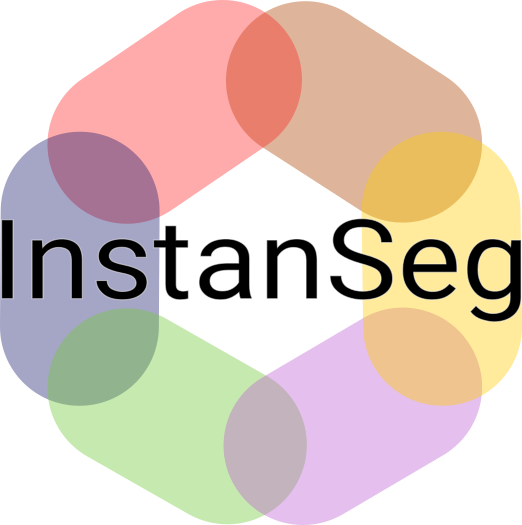

<!-- 
<p align="center">
  
</p> -->


## Overview

InstanSeg is a pytorch based cell and nucleus segmentation pipeline for fluorescent and brightfield microscopy images. This README provides instructions for setting up the environment, installing dependencies, and using the provided tools and models.

## Why should I use InstanSeg?

1. InstanSeg is fully open-source
2. It's much faster than other cell segmentation methods
3. Instanseg is highly accurate for both nucleus and cell segmentation
5. InstanSeg can be entirely (_including prostprocessing!_) compiled in TorchScript, which means it's easy to use in Python and DeepImageJ. This allows you to run InstanSeg directly in [QuPath](https://qupath.github.io/)!
6. InstanSeg can simultaneously detect nuclei and cells
7. You can use InstanSeg on multiplexed images (images that have more than three channels) on novel biomarker panels, without retraining or manual intervention.
8. We plan to release more InstanSeg models trained on public datasets. If there's a _public_ dataset (_i.e._ one with a recognized license) that we missed, let us know and we may be able to increase our InstanSeg model zoo.

## InstanSeg has its own QuPath extension!

InstanSeg is introduced in the [QuPath pre-release v0.6.0-rc2](https://github.com/qupath/qupath/releases/tag/v0.6.0-rc2), so you can start using InstanSeg immediately. You can find the standalone QuPath extension [here](https://github.com/qupath/qupath-extension-instanseg).

## How to cite InstanSeg:

If you use InstanSeg for nucleus segmentation if brightfield histology images, please cite:

> Goldsborough, T. et al. (2024) ‘InstanSeg: an embedding-based instance segmentation algorithm optimized for accurate, efficient and portable cell segmentation’. _arXiv_. Available at: https://doi.org/10.48550/arXiv.2408.15954.

If you use InstanSeg for nucleus and / or cell segmentation in fluorescence images, please cite:

> Goldsborough, T. et al. (2024) ‘A novel channel invariant architecture for the segmentation of cells and nuclei in multiplexed images using InstanSeg’. _bioRxiv_, p. 2024.09.04.611150. Available at: https://doi.org/10.1101/2024.09.04.611150.


<!-- 
<p align="center">
  
</p> -->


## Table of Contents

- [Installation](#installation)
  - [Local Installation](#local-installation)
  - [GPU Version (CUDA) for Windows and Linux](#gpu-version-cuda-for-windows-and-linux)
- [Usage](#usage)
  - [Training Models](#training-models)
  - [Testing Models](#testing-models)

## Installation

### Local Installation

To install InstanSeg locally, follow these steps:

1. Install either Anaconda, Mamba, or [micromamba](https://mamba.readthedocs.io/en/latest/installation/micromamba-installation.html). We use micromamba for speed and simplicity, but you can replace "micromamba" with the distribution you are using.

2. In your terminal or Anaconda prompt on Windows, create a new environment and install dependencies using the provided `env.yml` file:
    ```bash
    micromamba create -n instanseg --file env.yml
    ```

3. Activate your environment:
    ```bash
    micromamba activate instanseg
    ```

### GPU Version (CUDA) for Windows and Linux

If you intend to use GPU acceleration and CUDA, follow these additional steps:

4. Uninstall existing PyTorch and reinstall with CUDA support:
    ```bash
    micromamba remove pytorch torchvision monai
    micromamba install pytorch==2.1.1 torchvision==0.16.1 monai=1.3.0 pytorch-cuda=12.1 -c conda-forge -c pytorch -c nvidia
    pip install cupy-cuda12x
    ```

5. Check if CUDA is available:
    ```bash
    python -c "import torch; print('CUDA is available') if torch.cuda.is_available() else print('CUDA is not available')"
    ```

The repository may work with older versions of CUDA. For this replace "12.1" and "12" with the required version. 

### Setup Repository

3. Build repository:
    ```bash
    pip install -e .
    ```

## Usage

### Download Datasets

To download public datasets and example images, follow the instructions under **instanseg/notebooks/load_datasets.ipynb**

To train InstanSeg on your own dataset, extend the **instanseg/notebooks/load_datasets.ipynb** with one of the templates provided.

### Training Models

To train models using InstanSeg, use the **train.py** script under the scripts folder.

For example, to train InstanSeg on the TNBC_2018 dataset over 250 epochs at a pixel resolution of 0.25 microns/pixel, run the following command:
```bash
cd InstanSeg/scripts
python train.py -data segmentation_dataset.pth -source "[TNBC_2018]" --num_epochs 250 --experiment_str my_first_instanseg --requested_pixel_size 0.25
```

To train a channel invariant InstanSeg on the CPDMI_2023 dataset, predicting both nuclei and cells, run the following command:
```bash
cd InstanSeg/scripts
python train.py -data segmentation_dataset.pth -source "[CPDMI_2023]" --num_epochs 250 --experiment_str my_first_instanseg -target NC --channel_invariant True --requested_pixel_size 0.5
```

Each epoch should take approximately 1 to 3 minutes to complete (with mps or cuda support).

For more options and configurations, refer to the parser arguments in the train.py file.

### Testing Models

To test trained models and obtain F1 metrics, use the following command:
```bash
python test.py --model_folder my_first_instanseg -test_set Validation --optimize_hyperparameters True
python test.py --model_folder my_first_instanseg -test_set Test --params best_params
```

### Using InstanSeg for inference

```bash
python inference.py --model_folder my_first_instanseg --image_path ../examples
```
Replace "../examples" with the path to your images. If InstanSeg cannot read the image pixel size from the image metadata, the user is required to provide a --pixel_size parameter. InstanSeg provides (limited) support for whole slide images (WSIs). For more options and configurations, refer to the parser arguments in the inference.py file.
